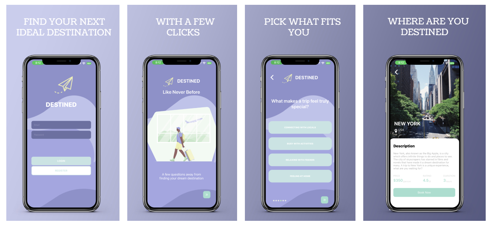

# Destined

Have you ever wanted to take a vacation or trip but don't know where to go or and are overwhelmed with options. Destined helps with solving that problem. You will be asked a few questions and based on your answers, an ideal destination will be picked for you! So where are you **DESTINED**?



## Tech Stack
### Frontend
- React Native with Axios 
- Expo
- Typescript
- CSS
- Figma
### Backend
- Node.js with Express.js for the Server
- Firebase for user authentication
- MongoDB and Mongoose as the Database

## Getting Started
- Choose an emulator such as **Expo Go**
- Download and setup Expo (or other emulator) on your phone
### Client
- Change directory into client folder
- To install dependencies, run:
```npm install```
- After dependencies have been installed, start the client:
```npm start```
- If you've chosen Expo, take a picture of the QR code with your phone and click the link
- This should automatically load the app on your phone
### Server
- Change directory into server folder
- Following the example in .env.example, add your credentials to your .env file
- To install the backend dependencies, run:
```npm install```
- Start the server:
```nodemon```
### Database
- Choose your ODM such as **MongoDB Compass**
- Set up your account and add your credentials to the .env file

## API Endpoints

| API                              | Method  | Endpoint                 |  Status |
| :------------------------------  | :------ | :----------------------- | ------: |
| 🙋‍♀️ Users                         |
| Register New User                | POST    | /register                      |     201 |
| User Login                       | POST    | /login                         |     200 |
| 📝 Destinations                  |
| Get Random Destination           | GET     | /destinations                  |     201 |

## Credit
Created and built by [Ammar Khomusi](https://github.com/AmmarKhomusi) - Full Stack Developers <br>
